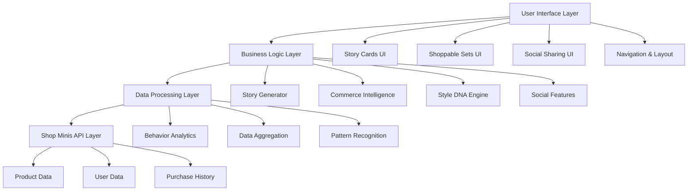

# Design Document

## Overview

Shop Story Core is a comprehensive feature that transforms user shopping behavior into engaging social stories and actionable commerce recommendations. The system consists of several interconnected components: a data analytics engine, story card generator, commerce intelligence system, social sharing capabilities, and a mobile-optimized user interface built on the Shop Minis React framework.

The architecture follows a modular approach with clear separation between data processing, UI components, and business logic, enabling scalable development and maintenance.

## Architecture

### High-Level Architecture



### Component Architecture

The application follows a component-based architecture with the following key modules:

1. **Core App Shell** - Main navigation and layout management
2. **Story System** - Story card generation and display
3. **Commerce Engine** - Product recommendations and shoppable sets
4. **Analytics Engine** - Behavior analysis and Style DNA tracking
5. **Social Features** - Sharing, comparisons, and export functionality

## Components and Interfaces

### Core Components

#### 1. StoryCardContainer
- **Purpose**: Main container for displaying 9:16 story cards
- **Props**: `stories: StoryCard[]`, `currentIndex: number`, `onSwipe: (direction) => void`
- **Features**: Swipe navigation, lazy loading, touch gestures
- **Integration**: Uses Shop Minis touch handling and responsive design

#### 2. StoryCard
- **Purpose**: Individual story card component with analytics visualization
- **Props**: `story: StoryData`, `isActive: boolean`, `onShare: () => void`
- **Features**: Animated insights, progress indicators, interactive elements
- **Variants**: Behavioral insights, style evolution, shopping recaps

#### 3. ShoppableSetCard
- **Purpose**: Product collection display with purchase integration
- **Props**: `productSet: ProductSet`, `insight: string`, `onAddToCart: (product) => void`
- **Features**: Product grid, pricing, availability, urgency indicators
- **Integration**: Uses Shop Minis ProductCard components

#### 4. StyleDNAVisualizer
- **Purpose**: Visual representation of user's evolving style profile
- **Props**: `styleDNA: StyleProfile`, `timeRange: DateRange`
- **Features**: Color palettes, brand clouds, category breakdowns, trend lines

#### 5. SocialShareModal
- **Purpose**: Export and sharing interface for story cards
- **Props**: `content: ShareableContent`, `platforms: Platform[]`
- **Features**: Format optimization, friend comparisons, creator templates

### Data Interfaces

#### StoryData Interface
```typescript
interface StoryData {
  id: string
  type: 'behavioral' | 'style-evolution' | 'recap' | 'seasonal'
  title: string
  insights: Insight[]
  visualElements: VisualElement[]
  shoppableProducts?: Product[]
  shareableContent: ShareableContent
  createdAt: Date
  expiresAt?: Date
}
```

#### StyleProfile Interface
```typescript
interface StyleProfile {
  userId: string
  dominantColors: ColorProfile[]
  preferredBrands: BrandAffinity[]
  categoryPreferences: CategoryWeight[]
  priceRanges: PriceRange[]
  seasonalTrends: SeasonalData[]
  evolutionScore: number
  lastUpdated: Date
}
```

#### ProductSet Interface
```typescript
interface ProductSet {
  id: string
  name: string
  insight: string
  products: Product[]
  bundlePrice?: number
  urgencyLevel: 'low' | 'medium' | 'high'
  completionStatus: number
  expiresAt?: Date
}
```

## Data Models

### User Behavior Tracking

#### BehaviorEvent Model
- **Fields**: userId, eventType, productId, timestamp, metadata
- **Types**: view, add_to_cart, purchase, share, save
- **Storage**: Local state with periodic sync to Shop platform

#### ShoppingSession Model
- **Fields**: sessionId, userId, startTime, endTime, events, insights
- **Purpose**: Aggregate behavior for pattern recognition
- **Lifecycle**: Created on app launch, closed on app exit

### Analytics and Insights

#### InsightEngine Model
- **Responsibilities**: Pattern recognition, trend analysis, recommendation generation
- **Algorithms**: Frequency analysis, seasonal detection, style clustering
- **Output**: Actionable insights for story generation and product curation

#### StyleDNA Model
- **Evolution Tracking**: Monitors changes in user preferences over time
- **Scoring System**: Quantifies style consistency and evolution
- **Update Frequency**: Real-time for new purchases, weekly for trend analysis

### Commerce Integration

#### ProductCuration Model
- **Input**: User StyleDNA, current trends, inventory data
- **Processing**: Matching algorithms, bundle creation, pricing optimization
- **Output**: Curated product sets with relevance scores

## Error Handling

### Data Loading Errors
- **Scenario**: API failures, network issues, insufficient data
- **Strategy**: Graceful degradation with cached content, skeleton loading states
- **User Experience**: Clear error messages, retry mechanisms, offline support

### Analytics Processing Errors
- **Scenario**: Insufficient behavior data, processing failures
- **Strategy**: Fallback to popular products, guided onboarding prompts
- **Recovery**: Progressive data collection, manual preference input

### Social Sharing Errors
- **Scenario**: Export failures, platform compatibility issues
- **Strategy**: Multiple format options, local storage backup
- **Fallback**: Basic sharing with reduced functionality

### Performance Optimization
- **Image Loading**: Lazy loading, progressive enhancement, WebP support
- **Data Processing**: Background processing, incremental updates
- **Memory Management**: Component cleanup, efficient state management

## Testing Strategy

### Unit Testing
- **Components**: Story cards, product displays, analytics visualizations
- **Business Logic**: Style DNA calculations, product curation algorithms
- **Data Processing**: Behavior analysis, pattern recognition functions
- **Tools**: Jest, React Testing Library, TypeScript type checking

### Integration Testing
- **API Integration**: Shop Minis hooks and components
- **Data Flow**: End-to-end behavior tracking and insight generation
- **User Interactions**: Touch gestures, navigation, sharing workflows
- **Cross-Component**: Story generation to product recommendations

### User Experience Testing
- **Mobile Responsiveness**: Various screen sizes and orientations
- **Touch Interactions**: Swipe gestures, tap targets, scroll behavior
- **Performance**: Loading times, animation smoothness, memory usage
- **Accessibility**: Screen reader support, keyboard navigation, color contrast

### Social Features Testing
- **Export Functionality**: Multiple formats, platform compatibility
- **Sharing Workflows**: Friend comparisons, creator templates
- **Content Generation**: Story card creation, insight accuracy
- **Privacy**: Data handling, user consent, sharing permissions

## Technical Implementation Notes

### Shop Minis Integration
- **Framework**: Built on @shopify/shop-minis-react components
- **Navigation**: Utilizes Shop app navigation patterns
- **Product Data**: Leverages existing Shop Minis product hooks
- **Performance**: Optimized for WebView environment

### Mobile Optimization
- **Touch Gestures**: Native-feeling swipe and tap interactions
- **Responsive Design**: Tailwind CSS with mobile-first approach
- **Loading Strategy**: Progressive loading with skeleton states
- **Offline Support**: Cached content for core functionality

### Data Privacy and Security
- **User Data**: Anonymized analytics, opt-in sharing
- **Storage**: Local storage with encrypted sensitive data
- **Compliance**: GDPR-compliant data handling
- **Permissions**: Granular privacy controls for users